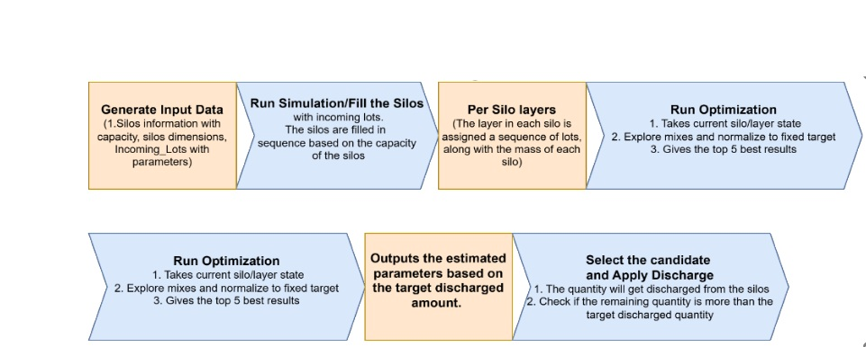

# Architecture

Last Updated: 2026-04-22

This service is an offline-first simulation and optimization engine for silo discharge and blend quality prediction.

See also:
- Root overview: [README.md](README.md)
- API contracts: [src/dem_sim/API.md](src/dem_sim/API.md)
- Full deep dive: [docs/system_technical_documentation.md](docs/system_technical_documentation.md)

## Platform Fit

This service fits into BrewQuanta's platform as the simulation and optimization engine for:
- silo inventory lifecycle execution (fill, optimize, apply discharge)
- blend-quality prediction for operational decision support
- persistence of simulation events/results for auditability and replay

## Architecture Diagram

If the image does not render, place the diagram file at:
`docs/images/flow-diagram.jpg`

## High-Level Components

1. Backend API (FastAPI)
- File: `src/dem_sim/web.py`
- Role: orchestration, validation, optimization loops, schedule endpoints, persistence calls.

2. Simulation/Optimization Core
- Files: `src/dem_sim/service.py`, `src/dem_sim/model.py`
- Role: execute discharge physics, layer contribution simulation, blended parameter estimation.

3. State and Inventory Engine
- File: `src/dem_sim/state.py`
- Role: in-memory state lifecycle, fill simulation, discharge application.

4. Persistence Layer
- Files: `src/dem_sim/db.py`, `src/dem_sim/schema.py`, `src/dem_sim/storage.py`
- Role: PostgreSQL access, schema management, event/result snapshots.

5. Data and Validation
- Files: `src/dem_sim/sample_data.py`, `src/dem_sim/synthetic.py`, `src/dem_sim/reporting.py`
- Role: seed/random data generation and input/COA validation.

## Request Flow (Text Diagram)

`Client -> FastAPI endpoint (web.py) -> validate inputs -> run_blend/model simulation -> score/rank (optimize path) -> persist events/results -> response`

## Core Runtime Paths

- Fill simulation: `POST /api/process/run_simulation`
- Single run: `POST /api/run`
- Optimization: `POST /api/optimize`
- Schedule optimize: `POST /api/schedules/{schedule_id}/items/{brew_id}/optimize`
- Apply discharge: `POST /api/process/apply_discharge`

## Data Persistence Summary

Main operational tables:
- `silos`
- `layers`
- `suppliers`
- `incoming_queue`
- `sim_events`
- `results_run`
- `results_optimize`
- `discharge_results`
- `brew_schedules`
- `brew_schedule_items`

## Documentation Maintenance

- Update this file whenever major components, data flows, or persistence boundaries change.
- Keep links in sync with [README.md](README.md), [src/dem_sim/API.md](src/dem_sim/API.md), and [src/dem_sim/CONFIG.md](src/dem_sim/CONFIG.md).
